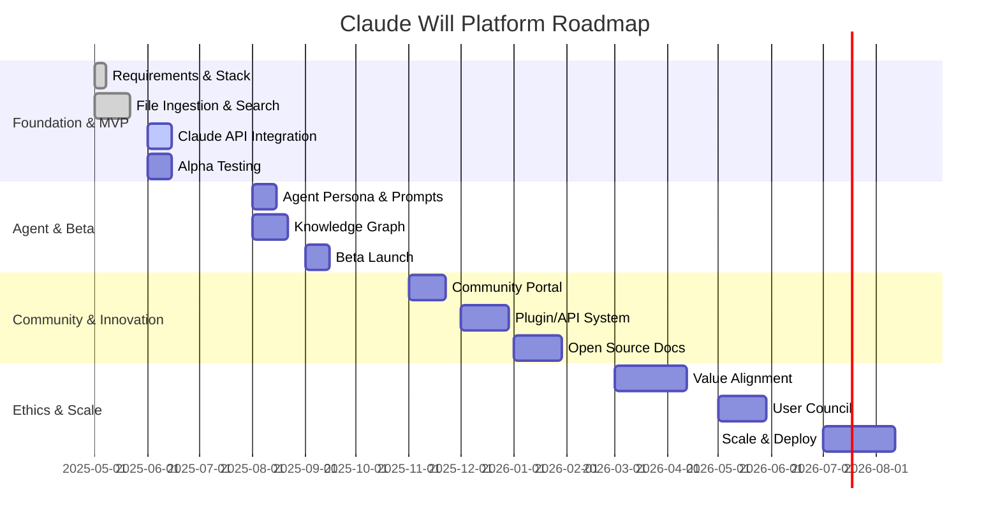

# Claude Will Platform: Roadmap, Implementation Plan, Guide, Technical Spec & CI/CD

## Overview

This document is the single source of truth for the Claude Will platform: vision, phased roadmap, implementation plan, technical guide, technical specification, and CI/CD recommendations.

---

## Platform Roadmap

### Phase 1: Foundation & MVP (May–July 2025)

- **Milestones:**
  - Define requirements and success metrics
  - Set up core tech stack (Electron.js, Python, SQLite, ChromaDB, React)
  - Ingest and process 500–1,000 markdown files
  - Implement semantic search and basic UI
  - Integrate Anthropic Claude API for Q&A
  - Internal alpha testing
- **Deliverables:**
  - Working desktop prototype
  - Indexed, searchable knowledge base
  - Initial documentation
- **Success Criteria:**
  - > 90% file processing
    >
  - Relevant results in top 5 hits for >80% of queries

---

### Phase 2: Agent Development & Beta (Aug–Oct 2025)

- **Milestones:**
  - Develop Claude Will agent persona and system prompts (RWTFYA, constitutional AI)
  - Expand UI for chat and multi-modal querying
  - Add knowledge graph visualization
  - Implement user feedback loop
  - Launch closed beta with select users
- **Deliverables:**
  - Claude Will agent (chat, search, knowledge graph)
  - Beta documentation and onboarding
  - Feedback collection system
- **Success Criteria:**
  - 75%+ positive user feedback
  - 10+ non-obvious knowledge connections discovered

---

### Phase 3: Community & Continuous Innovation (Nov 2025–Feb 2026)

- **Milestones:**
  - Open alpha/beta to wider community
  - Add multi-model querying (OpenAI, local LLMs)
  - Launch plugin/API architecture for contributors
  - Regular feature updates (biweekly sprints)
  - Begin open-source documentation
- **Deliverables:**
  - Community portal and contributor docs
  - Plugin/API system
  - Public changelog and roadmap
- **Success Criteria:**
  - 20+ active contributors/testers
  - 2+ community-built plugins

---

### Phase 4: Ethics, Alignment & Scale (Mar–Dec 2026)

- **Milestones:**
  - Implement advanced value-alignment and guardrails (constitutional AI)
  - Launch user council/advisory board
  - Conduct regular AI audits and publish results
  - Scale platform for consulting, thought leadership, and learning
- **Deliverables:**
  - Value-alignment dashboard
  - Ethics & governance documentation
  - Scalable deployment (cloud, desktop, API)
- **Success Criteria:**
  - 100% compliance with published ethical standards
  - 50+ organizations/teams using the platform

---

### Visual Roadmap



---

## Implementation Plan

### Claude Will Widget: Plan & Technical Specification

This section details the implementation plan, features, and technical specifications for the Claude Will intelligent widget.

#### Overview
The widget is a cross-domain intelligent interface that makes Claude Will accessible across all pages of the site, enhancing user capability while maintaining context awareness.

#### Implementation Timeline

##### Week 1: Foundation
- **Day 1-2: Setup:** Initialize project, set up dev environment, configure build tools.
- **Day 3-4: Core Widget:** Implement basic UI, styling, and interactions.
- **Day 5: Context Detection:** Implement initial context detection based on URL.

##### Week 2: Features
- **Day 1-2: Search:** Implement search interface, results, and history.
- **Day 3-4: Chat:** Implement chat interface and message handling.
- **Day 5: Integration:** Connect to Claude Will API, handle errors and loading states.

##### Week 3: Enhancement
- **Day 1-2: Performance:** Optimize bundle size, implement lazy loading and caching.
- **Day 3-4: Mobile:** Test and optimize for mobile devices, add touch support.
- **Day 5: Analytics:** Implement basic tracking and performance monitoring.

##### Week 4: Testing & Deployment
- **Day 1-2: Testing:** Write unit, integration, and E2E tests.
- **Day 3-4: Documentation:** Create technical docs, user guide, and API docs.
- **Day 5: Deployment:** Prepare for production, run security scans, and deploy.

#### Completed & Planned Features

##### Core Features (Completed)
- Floating chat interface
- Context-aware responses
- Real-time chat functionality
- Search history and suggestions
- Mobile-responsive and accessible design (ARIA, keyboard nav, high contrast)

##### Next Steps: High Priority
- **Analytics Integration:** Track usage patterns, queries, and engagement.
- **Performance Optimization:** Lazy loading, service workers, asset optimization.
- **Enhanced Context Awareness:** Improve page context detection, add domain-specific knowledge.

##### Next Steps: Medium Priority
- **UX Improvements:** Typing indicators, message reactions, file attachments.
- **Integration:** Widget state management, configuration options.
- **Testing:** Comprehensive unit, E2E, and performance tests.

##### Next Steps: Low Priority
- **Additional Features:** Voice input, message translation, theming.
- **Documentation:** User guides, API documentation, and integration guides.

#### Technical Specification

- **Tech Stack:** React-based search interface, vanilla JS for widget wrapper, responsive CSS.
- **Dependencies:** React, Material Icons, Local Storage API, Claude Will API.
- **Browser Support:** Latest Chrome, Firefox, Safari, Edge, and mobile browsers (iOS 12+, Android 8+).
- **Performance Targets:** Initial load < 2s, response time < 1s, memory usage < 50MB.
- **Security:** Input sanitization, XSS/CSRF protection, rate limiting, data encryption.
- **Monitoring:** Error tracking, performance metrics, usage statistics, user feedback.

---

## Implementation Guide

# Claude Will Widget Implementation Guide

## Getting Started

### Prerequisites

- Node.js 16+
- npm 8+
- Git

### Installation

```bash
# Clone repository
git clone https://github.com/your-org/claude-will-widget.git

# Install dependencies
npm install

# Start development server
npm run dev
```

### Configuration

```javascript
// config.js
export const config = {
  apiKey: process.env.CLAUDE_WILL_API_KEY,
  environment: process.env.NODE_ENV,
  analytics: {
    enabled: true,
    endpoint: process.env.ANALYTICS_ENDPOINT
  }
};
```

## Development Workflow

### 1. Component Development

```bash
# Create new component
npm run create:component Widget

# Run tests
npm run test:watch

# Build component
npm run build
```

### 2. Testing

```bash
# Run unit tests
npm run test:unit

# Run integration tests
npm run test:integration

# Run E2E tests
npm run test:e2e
```

### 3. Deployment

```bash
# Build for production
npm run build:prod

# Deploy to staging
npm run deploy:staging

# Deploy to production
npm run deploy:prod
```

## Best Practices

### Code Style

- Use TypeScript
- Follow ESLint rules
- Use Prettier for formatting
- Write meaningful comments

### Testing

- Write tests for all components
- Maintain 80% coverage
- Use meaningful test descriptions
- Mock external dependencies

### Performance

- Lazy load components
- Optimize images
- Use code splitting
- Implement caching

### Security

- Validate all input
- Sanitize output
- Use HTTPS
- Implement rate limiting

## Troubleshooting

### Common Issues

1. API Connection
   - Check API key
   - Verify network connection
   - Check rate limits
2. Performance
   - Check bundle size
   - Monitor memory usage
   - Review network requests
3. Testing
   - Check test environment
   - Verify mocks
   - Check coverage

## Maintenance

### Regular Tasks

1. Update dependencies
2. Run security scans
3. Monitor performance
4. Review analytics

### Emergency Procedures

1. Rollback deployment
2. Disable features
3. Contact support
4. Document incident

---

## Technical Specification

# Claude Will Widget Technical Specification

---

Ran tool
Read file: /Users/dereksimmons/Desktop/claudewill.io/js/claude-will-widget.js
Read file: /Users/dereksimmons/Desktop/claudewill.io/css/claude-will-widget.css
Read file: /Users/dereksimmons/Desktop/claudewill.io/js/claude-will-chat-enhancement.js
Here is a detailed technical specification for the Claude Will Widget, ready to be added to your unified `roadmap_and_project_plan.md`:

---

## Technical Specification

### 1. Architecture Overview

- **Type:** Vanilla JavaScript widget, no framework dependencies.
- **Integration:** Injected via a `<script>` tag and initialized on DOMContentLoaded.
- **UI:** Renders a floating chat widget on every page, styled via a dedicated CSS file.
- **Context Awareness:** Detects the current page context (e.g., resume, documentation, about) for context-sensitive responses.
- **Accessibility:** Uses ARIA labels, keyboard navigation, and responsive design for accessibility and mobile support.

---

### 2. Component Structure

- **Widget Container (`.claude-will-widget`):**The root element, fixed to the bottom-right of the viewport.
- **Toggle Button (`.widget-toggle`):**Opens/closes the chat interface; accessible via keyboard and screen readers.
- **Widget Content (`.widget-content`):**Contains the chat interface, header, body, and close button.
- **Header (`.widget-header`):**Displays the widget title and a close button.
- **Body (`.widget-body`):**Contains the chat messages and input form.
- **Chat Messages (`.chat-messages`):**Scrollable area for conversation history.
- **Chat Input (`.chat-input`):**
  Text input and send button for user messages.

---

### 3. Data Flow & Logic

- **Initialization:**
  - Widget is appended to `document.body` on page load.
  - Event listeners are set up for toggling, closing, submitting input, and mobile-specific behaviors.
- **Context Detection:**
  - Uses `window.location.pathname` to set `currentContext` (e.g., 'resume-engine', 'documentation', 'about').
- **User Interaction:**
  - User types a message and submits via the form.
  - Message is added to the chat history.
  - Widget calls `window.ClaudeWill.getResponse(formattedMessage)` to get a response (integration point for backend/AI).
  - Response is displayed in the chat.
- **Mobile & Accessibility:**
  - Handles virtual keyboard, pull-to-refresh, and orientation changes.
  - Responsive design adapts layout for small screens.
  - ARIA labels and keyboard navigation for accessibility.

---

### 4. Styling & Theming

- **CSS File:** `/css/claude-will-widget.css`
- **Key Features:**
  - Fixed position, rounded corners, drop shadows for modern look.
  - Responsive breakpoints for mobile and small screens.
  - Theming via CSS variables (e.g., `--color-primary`).
  - Dark mode support via `@media (prefers-color-scheme: dark)`.
  - High-contrast and accessible color choices.
  - Large touch targets for mobile usability.

---

### 5. Extensibility & Integration Points

- **Backend Integration:**
  - Expects a global `window.ClaudeWill.getResponse()` function for AI/chat responses.
- **Enhancements:**
  - Can be extended with conversation memory, advanced context detection, or richer UI.
  - Additional logic (e.g., from `claude-will-chat-enhancement.js`) can be integrated for advanced features like topic tracking, follow-ups, and cross-domain pattern recognition.

---

### 6. Accessibility & UX

- **Keyboard Navigation:**
  - All interactive elements are focusable and operable via keyboard.
- **Screen Reader Support:**
  - ARIA labels on toggle and close buttons.
- **Mobile Support:**
  - Touch-friendly controls, pull-to-refresh, and orientation handling.
- **Performance:**
  - Lightweight, loads asynchronously, minimal impact on page load.

---

### 7. Security Considerations

- **Input Validation:**
  - User input is trimmed and sanitized before processing.
- **Isolation:**
  - Widget runs in its own DOM subtree, minimizing risk of interfering with page content.
- **Error Handling:**
  - Graceful fallback if the backend/AI is unavailable.

---

### 8. Deployment & Usage

- **Include in HTML:**
  ```html
  <link rel="stylesheet" href="/css/claude-will-widget.css">
  <script src="/js/claude-will-widget.js"></script>
  <script>
    document.addEventListener('DOMContentLoaded', function() {
      new ClaudeWillWidget();
    });
  </script>
  ```
- **Customization:**
  - The widget can be themed or extended by modifying the CSS or JS files.

---

Would you like this specification added to your unified document now? If so, I'll insert it under the "Technical Specification" section.

# Detailed CI/CD Analysis for Claude Will

## Current State Assessment

### 1. **Existing CI/CD Infrastructure**

- **GitHub Actions Workflow**: Well-structured multi-job pipeline
- **Quality Gates**: HTML/CSS/JS linting, accessibility checks, broken link detection, Lighthouse performance
- **Deployment**: Automated GitHub Pages deployment after all checks pass
- **Dependencies**: Modern tooling with npm, Node.js 20, and various linters

### 2. **Project Architecture**

- **Main Site**: Static HTML/CSS/JS with no build process required
- **Resume Engine**: React-based application with Vite build system
- **Documentation**: Markdown files with optional Pandoc conversion
- **Widget System**: Vanilla JS implementation across all pages

## Strengths of Current CI/CD

1. **Comprehensive Quality Checks**

   - Code quality (ESLint, Stylelint, HTMLHint)
   - Accessibility (pa11y-ci)
   - Link integrity (lychee)
   - Performance (Lighthouse)
2. **Parallel Job Execution**

   - All lint jobs run in parallel for faster feedback
   - Only deploys after all checks pass
3. **Modern Tooling**

   - Node.js 20 for latest features
   - GitHub Actions v3/v4 for reliability
   - Rust-based lychee for fast link checking

## Areas for Improvement

### 1. **Build Process Gaps**

- **Resume Engine**: No automated build/test in CI pipeline
- **Widget Testing**: No automated tests for Claude Will widget functionality
- **Documentation**: No automated documentation generation from Markdown

### 2. **Testing Coverage**

- **Unit Tests**: None implemented
- **Integration Tests**: No E2E testing for widget interactions
- **Visual Regression**: No screenshot comparison tests

### 3. **Deployment Strategy**

- **Single Environment**: Only production deployment
- **No Staging**: No preview deployments for PRs
- **Manual Rollback**: No automated rollback mechanism

### 4. **Monitoring & Observability**

- **No Error Tracking**: Missing production error monitoring
- **No Analytics**: Widget usage and performance not tracked
- **No Alerts**: No automated alerts for deployment failures

## Recommended CI/CD Enhancements

### Phase 1: Immediate Improvements (1-2 weeks)

1. **Add Resume Engine Build**

```yaml
build-resume-engine:
  name: Build Resume Engine
  runs-on: ubuntu-latest
  steps:
    - uses: actions/checkout@v3
    - uses: actions/setup-node@v3
      with:
        node-version: 20
    - run: cd resume-engine && npm install
    - run: cd resume-engine && npm run build
    - uses: actions/upload-artifact@v3
      with:
        name: resume-engine-dist
        path: resume-engine/dist/
```

2. **Enable Preview Deployments**

```yaml
preview:
  if: github.event_name == 'pull_request'
  runs-on: ubuntu-latest
  steps:
    - uses: actions/checkout@v3
    - uses: actions/configure-pages@v3
    - name: Deploy to preview
      uses: cloudflare/pages-action@v1
      with:
        apiToken: ${{ secrets.CLOUDFLARE_API_TOKEN }}
        accountId: ${{ secrets.CLOUDFLARE_ACCOUNT_ID }}
        projectName: claudewill-preview
```

3. **Add Basic Widget Tests**

```yaml
test-widget:
  name: Test Claude Will Widget
  runs-on: ubuntu-latest
  steps:
    - uses: actions/checkout@v3
    - uses: actions/setup-node@v3
    - run: npm install
    - run: npm install --save-dev jest @testing-library/jest-dom
    - run: npm test js/claude-will-widget.test.js
```

### Phase 2: Enhanced Testing (2-4 weeks)

1. **E2E Testing with Playwright**

```yaml
e2e-tests:
  name: E2E Tests
  runs-on: ubuntu-latest
  steps:
    - uses: actions/checkout@v3
    - uses: actions/setup-node@v3
    - run: npm install
    - run: npx playwright install
    - run: npx playwright test
```

2. **Visual Regression Testing**

```yaml
visual-tests:
  name: Visual Regression
  runs-on: ubuntu-latest
  steps:
    - uses: actions/checkout@v3
    - uses: percy/snapshot-action@v1
      with:
        percy-token: ${{ secrets.PERCY_TOKEN }}
```

3. **Performance Budget Enforcement**

```yaml
performance-budget:
  name: Performance Budget
  runs-on: ubuntu-latest
  steps:
    - uses: actions/checkout@v3
    - run: npm install
    - run: |
        npx lighthouse-ci assert \
          --preset="lighthouse:recommended" \
          --assertions.categories.performance=90 \
          --assertions.categories.accessibility=95
```

### Phase 3: Production Monitoring (4-6 weeks)

1. **Error Tracking Integration**

```javascript
// Add to claude-will-widget.js
window.addEventListener('error', (event) => {
  if (window.Sentry) {
    Sentry.captureException(event.error);
  }
});
```

2. **Analytics Implementation**

```javascript
// Track widget interactions
function trackWidgetEvent(action, label) {
  if (window.gtag) {
    gtag('event', action, {
      event_category: 'Claude Will Widget',
      event_label: label
    });
  }
}
```

3. **Deployment Notifications**

```yaml
notify-deployment:
  needs: deploy
  runs-on: ubuntu-latest
  steps:
    - name: Notify Slack
      uses: 8398a7/action-slack@v3
      with:
        status: ${{ job.status }}
        webhook_url: ${{ secrets.SLACK_WEBHOOK }}
```

## Recommended Tools & Services

### Essential (Free Tier Available)

1. **Sentry**: Error tracking and performance monitoring
2. **Cloudflare Pages**: Preview deployments and CDN
3. **GitHub Actions**: Existing CI/CD platform
4. **Playwright**: E2E testing framework

### Nice to Have

1. **Percy**: Visual regression testing
2. **Datadog**: APM and infrastructure monitoring
3. **LaunchDarkly**: Feature flags for gradual rollouts
4. **Speedcurve**: Performance monitoring

## Implementation Roadmap

### Week 1-2

- [ ] Add Resume Engine build to CI pipeline
- [ ] Implement basic Jest tests for widget
- [ ] Set up preview deployments for PRs
- [ ] Add deployment notifications

### Week 3-4

- [ ] Implement E2E tests with Playwright
- [ ] Add visual regression testing
- [ ] Set up performance budgets
- [ ] Create staging environment

### Week 5-6

- [ ] Integrate error tracking (Sentry)
- [ ] Implement analytics for widget usage
- [ ] Add production monitoring dashboards
- [ ] Create rollback procedures

### Week 7-8

- [ ] Add feature flags for gradual rollouts
- [ ] Implement A/B testing framework
- [ ] Create deployment runbooks
- [ ] Set up on-call procedures

## Success Metrics

1. **Deployment Frequency**: Target 2-3 deployments per week
2. **Lead Time**: < 30 minutes from commit to production
3. **MTTR**: < 15 minutes for rollback
4. **Test Coverage**: > 80% for critical paths
5. **Performance**: All pages < 3s load time
6. **Availability**: 99.9% uptime

## Risk Mitigation

1. **Gradual Rollout**: Use feature flags for new features
2. **Automated Rollback**: One-click rollback to previous version
3. **Monitoring**: Real-time alerts for errors and performance
4. **Documentation**: Runbooks for common issues

## Conclusion

Claude Will has a solid foundation for CI/CD with comprehensive quality checks. The main opportunities are:

1. Adding automated testing (unit, integration, E2E)
2. Implementing preview/staging environments
3. Adding production monitoring and observability
4. Building the Resume Engine as part of CI

These improvements will enable faster, safer deployments while maintaining high quality standards.

---

*This document replaces the previous IMPLEMENTATION_PLAN.md, IMPLEMENTATION_GUIDE.md, and TECHNICAL_SPEC.md. For historical versions, see /archived/.*
