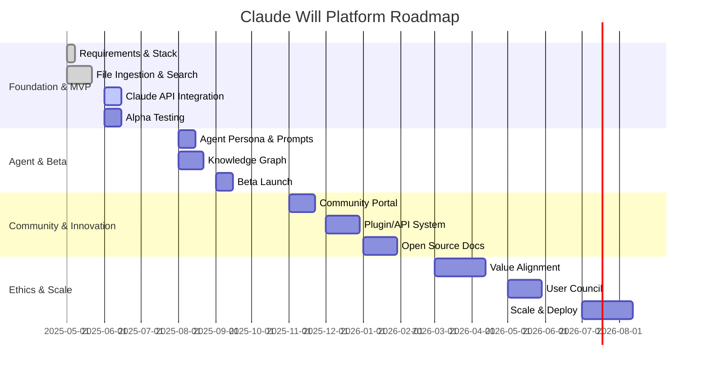

# Claude Will Platform: Roadmap & Project Plan

## Overview
This roadmap outlines the phased development of the Claude Will platform and agent, blending human-centered philosophy with advanced AI. Each phase includes key milestones, deliverables, and success criteria.

---

## Phase 1: Foundation & MVP (May–July 2025)
- **Milestones:**
  - Define requirements and success metrics
  - Set up core tech stack (Electron.js, Python, SQLite, ChromaDB, React)
  - Ingest and process 500–1,000 markdown files
  - Implement semantic search and basic UI
  - Integrate Anthropic Claude API for Q&A
  - Internal alpha testing
- **Deliverables:**
  - Working desktop prototype
  - Indexed, searchable knowledge base
  - Initial documentation
- **Success Criteria:**
  - >90% file processing
  - Relevant results in top 5 hits for >80% of queries

---

## Phase 2: Agent Development & Beta (Aug–Oct 2025)
- **Milestones:**
  - Develop Claude Will agent persona and system prompts (RWTFYA, constitutional AI)
  - Expand UI for chat and multi-modal querying
  - Add knowledge graph visualization
  - Implement user feedback loop
  - Launch closed beta with select users
- **Deliverables:**
  - Claude Will agent (chat, search, knowledge graph)
  - Beta documentation and onboarding
  - Feedback collection system
- **Success Criteria:**
  - 75%+ positive user feedback
  - 10+ non-obvious knowledge connections discovered

---

## Phase 3: Community & Continuous Innovation (Nov 2025–Feb 2026)
- **Milestones:**
  - Open alpha/beta to wider community
  - Add multi-model querying (OpenAI, local LLMs)
  - Launch plugin/API architecture for contributors
  - Regular feature updates (biweekly sprints)
  - Begin open-source documentation
- **Deliverables:**
  - Community portal and contributor docs
  - Plugin/API system
  - Public changelog and roadmap
- **Success Criteria:**
  - 20+ active contributors/testers
  - 2+ community-built plugins

---

## Phase 4: Ethics, Alignment & Scale (Mar–Dec 2026)
- **Milestones:**
  - Implement advanced value-alignment and guardrails (constitutional AI)
  - Launch user council/advisory board
  - Conduct regular AI audits and publish results
  - Scale platform for consulting, thought leadership, and learning
- **Deliverables:**
  - Value-alignment dashboard
  - Ethics & governance documentation
  - Scalable deployment (cloud, desktop, API)
- **Success Criteria:**
  - 100% compliance with published ethical standards
  - 50+ organizations/teams using the platform

---

## Visual Roadmap

---

## Project Plan: Key Activities
- **Biweekly Sprints:** Feature development, bug fixes, and roadmap reviews
- **Monthly Community Calls:** Gather feedback, demo new features, align on priorities
- **Quarterly AI Audits:** Review value alignment, ethics, and user impact
- **Annual Roadmap Review:** Update phases, milestones, and success criteria

---

*This roadmap and project plan are living documents. Update as the platform and community evolve.*
